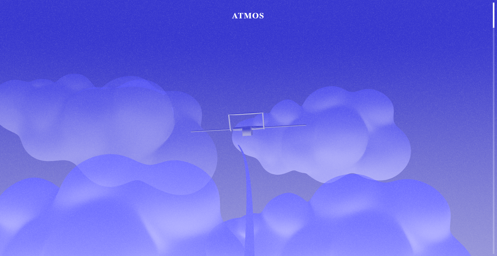

# ✈️ MALISH - Interactive 3D Flight Experience

An immersive, scroll-based 3D web experience featuring an animated airplane journey through a procedurally generated atmospheric environment. Built with React and Three.js, this project showcases advanced 3D graphics, smooth animations, and interactive storytelling through web technologies.



## 🌟 Features

- **Interactive 3D Scene**: Scroll-controlled camera animation following a smooth flight path
- **Custom 3D Airplane Model**: Realistic aircraft with proper rotations and scaling along a Catmull-Rom curve
- **Atmospheric Effects**: Post-processing effects including noise and fade animations
- **Narrative Journey**: Text overlay sections timed along the flight path for storytelling
- **Smooth Scroll Physics**: Dampened scrolling with easing for a polished user experience
- **Performance Optimized**: Canvas-based rendering with React Context for state management
- **Hot Module Replacement**: Vite's HMR for seamless development experience

## 🛠️ Tech Stack

**Core Technologies:**

- React 18.2 - UI framework
- Three.js 0.160 - 3D graphics library
- React Three Fiber 8.15 - React renderer for Three.js
- React Three Drei 9.93 - Essential helpers for React Three Fiber
- Vite 5.0 - Build tool and dev server

**Animation & Effects:**

- GSAP 3.12 - Professional animation library
- React Three Postprocessing 2.15 - Post-processing effects
- Lamina 1.1 - Layered shader material library

**Development:**

- ESLint - Code quality and consistency
- Vite Plugin React - Babel-powered Fast Refresh

## 🚀 Getting Started

### Prerequisites

- Node.js (v16 or higher)
- npm or yarn

### Installation

```bash
# Install dependencies
npm install

# Start development server
npm run dev

# Build for production
npm run build

# Preview production build
npm preview

# Run linting
npm run lint
```

## 📁 Project Structure

```
src/
├── components/
│   ├── Airplane.jsx      # 3D airplane model component
│   ├── Background.jsx    # Scene background
│   ├── Cloud.jsx         # Cloud elements
│   ├── Home.jsx          # Main scene container
│   ├── Overlay.jsx       # UI overlay and intro/outro
│   ├── Speed.jsx         # Speed indicators
│   └── TextSection.jsx   # Text elements along journey
├── contexts/
│   └── Play.jsx          # Play state management
├── utils/
│   └── fadeMaterial.js   # Custom fade shader material
├── assets/
│   └── models/3D/        # 3D model files
├── App.jsx               # Root component
├── main.jsx              # Entry point
└── index.css             # Global styles
```

## 🎨 Key Components

- **Airplane Component**: Loads and renders the 3D aircraft model with proper transformations
- **Home Component**: Orchestrates the main scene with curve-based camera/airplane animation
- **Overlay Component**: Manages UI elements, loading states, and user interactions
- **Play Context**: Handles global state for play/end states and scroll tracking

## 🏷️ Skills Demonstrated

- 3D Web Development
- Interactive Design & Animation
- React hooks and Context API
- WebGL and Shader Materials
- Performance Optimization
- Responsive Canvas Rendering

## 📝 Credits

- **Tutorial & Inspiration**: [Wawasenei](https://www.youtube.com/@wawasenei) - [YouTube Tutorial](https://www.youtube.com/watch?v=8r8rzp8t2aM&t=1s) | [Repository](https://github.com/wass08/r3f-wawatmos-final)
- **3D Airplane Model**: [Ab.316](https://sketchfab.com/Ab.316) - Licensed under CC-BY-4.0

## 📄 License

This project is open source and available under the MIT License.
